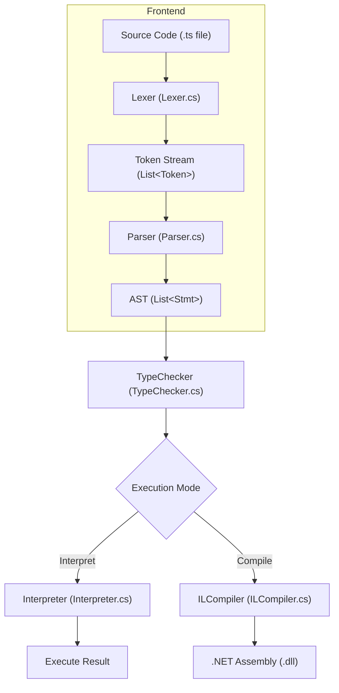
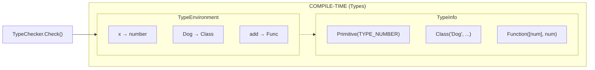
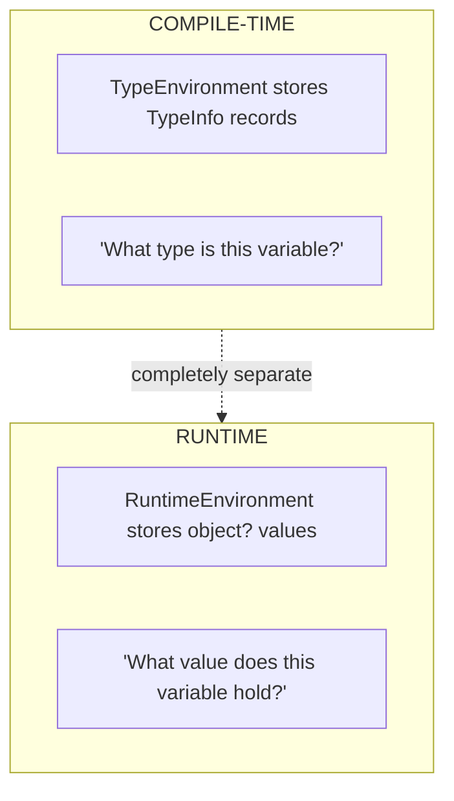
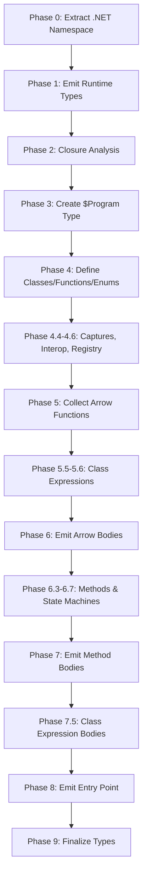

# SharpTS Architecture

SharpTS is a TypeScript interpreter and compiler implemented in C# (.NET 10). It supports two execution modes:

1. **Interpretation** - Tree-walking execution of TypeScript code
2. **AOT Compilation** - Ahead-of-time compilation to .NET IL assemblies

This document explains how the compiler and interpreter work internally.

---

## Pipeline Overview



**Entry Point**: `Program.cs` orchestrates the pipeline based on command-line arguments:
- No arguments → REPL mode
- `<file>.ts` → Interpret file
- `--compile <file>.ts` → Compile to .NET assembly

---

## Frontend Components

### Lexer (`Lexer.cs`, `Token.cs`)

The lexer performs single-pass tokenization, converting source text into a stream of tokens.

**Token Types** (58 total):
- Keywords: `class`, `function`, `const`, `let`, `if`, `while`, `for`, `return`, etc.
- Operators: `+`, `-`, `*`, `/`, `==`, `===`, `&&`, `||`, `?.`, `??`, etc.
- Literals: `NUMBER`, `STRING`, `IDENTIFIER`
- Template literals: `TEMPLATE_HEAD`, `TEMPLATE_MIDDLE`, `TEMPLATE_TAIL`

**Example**:
```
Input:  const x = 42;
Output: [CONST, IDENTIFIER("x"), EQUAL, NUMBER(42), SEMICOLON, EOF]
```

### Parser (`Parser.cs`)

A recursive descent parser that builds an Abstract Syntax Tree from tokens.

**Key Features**:
- Precedence climbing for expressions
- Desugaring: `for` loops → `while` loops during parsing
- Destructuring: `let [a, b] = arr` → temporary variable assignments
- Arrow function detection with backtracking

**Expression Precedence** (lowest to highest):
```
Assignment → Ternary → NullishCoalescing → Or → And → BitwiseOr →
BitwiseXor → BitwiseAnd → Equality → Comparison → Shift → Term →
Factor → Exponentiation → Unary → Call → Primary
```

### AST (`AST.cs`)

Immutable C# records representing the syntax tree.

**Expressions** (`Expr`):
```
Binary, Unary, Ternary, Logical          // Operators
Variable, Get, GetIndex, Set, SetIndex   // Data access
Literal, ArrayLiteral, ObjectLiteral     // Literals
Call, New, ArrowFunction                 // Functions
This, Super, Assign, CompoundAssign      // Special
```

**Statements** (`Stmt`):
```
Var, Function, Class, Interface, TypeAlias  // Declarations
If, While, DoWhile, ForOf, Switch           // Control flow
Block, Return, Break, Continue              // Structure
TryCatch, Throw                             // Errors
```

---

## Type System

SharpTS performs **static type checking before execution**. Type errors prevent code from running.



### TypeInfo (`TypeInfo.cs`)

Abstract record hierarchy representing types:

| Type | Description |
|------|-------------|
| `Primitive` | `string`, `number`, `boolean` |
| `Function` | Parameter types, return type, required param count |
| `Class` | Methods, static members, superclass chain |
| `Interface` | Member shapes for structural typing |
| `Instance` | Reference to a class type |
| `Array` | Element type |
| `Record` | Object literal shape `{key: type}` |
| `Void`, `Any` | Special types |

### TypeChecker (`TypeChecker.cs`)

Validates type correctness using two typing strategies:

- **Nominal typing** for classes: Inheritance chain must match
- **Structural typing** for interfaces: Shape must match (duck typing)

```typescript
interface Walkable { walk(): void }
class Dog { walk(): void { } }

let w: Walkable = new Dog();  // OK - Dog has walk() method
```

### TypeEnvironment (`TypeEnvironment.cs`)

Scoped symbol table for type information. Supports nested scopes via `Enclosing` property.

---

## Runtime System

### Two-Environment Architecture



These environments are **completely separate**. Type checking happens first; runtime never sees type information.

### Interpreter (`Interpreter.cs`)

Tree-walking interpreter that executes validated AST:

- `Execute(Stmt)` - Execute statements
- `Evaluate(Expr)` - Evaluate expressions to values
- `ExecuteBlock(stmts, env)` - Execute with scoped environment

### RuntimeEnvironment (`RuntimeEnvironment.cs`)

Scoped symbol table for runtime values:
- `Define(name, value)` - Create variable binding
- `Get(name)` - Retrieve value
- `Assign(name, value)` - Update existing binding

### Runtime Objects

| Class | Purpose |
|-------|---------|
| `SharpTSClass` | Class metadata, methods, static members |
| `SharpTSInstance` | Object instance with field dictionary |
| `SharpTSFunction` | Function with closure environment |
| `SharpTSArray` | Array with built-in methods |
| `SharpTSObject` | Object literal |
| `SharpTSMath` | Math singleton |

### Control Flow via Exceptions

The interpreter uses exceptions for control flow unwinding:
- `ReturnException` - Return from function
- `BreakException` - Break from loop/switch
- `ContinueException` - Continue to next iteration
- `ThrowException` - User-thrown errors

---

## IL Compilation

The IL compiler translates TypeScript to .NET assemblies as an alternative to interpretation.

### Multi-Phase Pipeline

The compiler runs through approximately 20 phases (with sub-phases) to handle the full complexity of TypeScript compilation:



**Key Phases:**

| Phase | Description |
|-------|-------------|
| 0 | Extract @Namespace directive for .NET namespace |
| 1 | Emit runtime support types (RuntimeTypes, TSFunction) |
| 2 | Analyze closures to identify captured variables |
| 3 | Create $Program container type |
| 4 | Define all classes, functions, enums, namespaces |
| 4.4-4.6 | Initialize captures, typed interop, type emitter registry |
| 5 | Collect and define arrow functions |
| 5.5-5.6 | Define class expression types and method signatures |
| 6 | Emit arrow function bodies |
| 6.3-6.7 | Define class methods, emit async/generator state machines |
| 7 | Emit all method bodies |
| 7.5 | Emit class expression bodies |
| 8 | Emit Main() entry point |
| 9 | Finalize all types, produce assembly |

### Key Components

**ILCompiler** (`Compilation/ILCompiler.cs`)
- Main orchestrator running the compilation phases
- Manages TypeBuilder instances
- Coordinates closure handling and state machine generation

**ILEmitter** (`Compilation/ILEmitter.cs`)
- Emits IL instructions for statements and expressions
- Handles special cases: `console.log`, `Math.*`, array methods
- Manages boxing/unboxing for value types

**ClosureAnalyzer** (`Compilation/ClosureAnalyzer.cs`)
- Walks AST to find captured variables
- Determines which arrows need display classes

**RuntimeTypes** (`Compilation/RuntimeTypes.cs`)
- Emits helper types into the assembly
- `TSFunction`: Wraps method references
- `RuntimeTypes`: 50+ helper methods for TypeScript semantics

### Closure Compilation

**Non-capturing arrow** → Static method on `$Program`:
```csharp
static object? <>Arrow_0(object? x) { return x + 1; }
```

**Capturing arrow** → Display class with captured fields:
```csharp
class <>c__DisplayClass0 {
    public object? capturedVar;
    public object? Invoke(object? arg) { return capturedVar + arg; }
}
```

---

## Key Architectural Patterns

### 1. Two-Environment Separation

Types and values never mix:
- `TypeEnvironment` + `TypeInfo` = compile-time
- `RuntimeEnvironment` + `object?` = runtime

### 2. Discriminated Unions

AST nodes use C# records with pattern matching:
```csharp
var result = expr switch {
    Expr.Binary b => HandleBinary(b),
    Expr.Call c => HandleCall(c),
    Expr.Variable v => HandleVariable(v),
    _ => throw new Exception("Unknown")
};
```

### 3. Visitor-Style Traversal

All phases use switch-based visitors on AST nodes:
- `TypeChecker.Check()` / `CheckExpr()`
- `Interpreter.Execute()` / `Evaluate()`
- `ILEmitter.EmitStatement()` / `EmitExpression()`

### 4. Exception-Based Control Flow

Return, break, continue, and yield use exceptions for stack unwinding rather than complex state tracking.

### 5. ISharpTSPropertyAccessor Interface

Unified property access abstraction implemented by `SharpTSObject` and `SharpTSInstance`:
```csharp
public interface ISharpTSPropertyAccessor {
    object? GetProperty(string name);
    void SetProperty(string name, object? value);
    bool HasProperty(string name);
    IEnumerable<string> PropertyNames { get; }
}
```

This reduces type-specific pattern matching in the interpreter and enables polymorphic property access.

### 6. State Machine Pattern

Async functions and generators compile to state machines:
- State stored in generated display classes
- `MoveNext()` method advances through suspension points
- Separate analyzers identify yield/await points and hoisted variables

### 7. Type Emitter Registry

Pluggable IL emission for type-specific operations:
- Registered emitters for String, Array, Date, Map, Set, RegExp, etc.
- Allows specialized IL generation without monolithic switch statements
- Static emitters for type constructors and static methods

---

## File Reference

### Core Pipeline

| File | Purpose |
|------|---------|
| `Program.cs` | Entry point, orchestrates pipeline |
| `Parsing/Lexer.cs` | Tokenization |
| `Parsing/Token.cs` | Token types and representation |
| `Parsing/Parser.cs` | Recursive descent parser (10 partial files) |
| `Parsing/AST.cs` | AST node definitions |
| `TypeSystem/TypeChecker.cs` | Static type analysis (20 partial files) |
| `TypeSystem/TypeInfo.cs` | Type representations |
| `TypeSystem/TypeEnvironment.cs` | Compile-time symbol table |
| `TypeSystem/TypeMap.cs` | Type mapping utilities |
| `Execution/Interpreter.cs` | Tree-walking execution (see partial classes below) |
| `Runtime/RuntimeEnvironment.cs` | Runtime symbol table |

### Runtime Objects (31 files)

**Core Types:**
| File | Purpose |
|------|---------|
| `SharpTSClass.cs` | Class metadata and methods |
| `SharpTSInstance.cs` | Object instances (implements ISharpTSPropertyAccessor) |
| `SharpTSFunction.cs` | Callable functions with closures |
| `SharpTSArray.cs` | Array implementation |
| `SharpTSObject.cs` | Object literal (implements ISharpTSPropertyAccessor) |
| `SharpTSMath.cs` | Math object singleton |
| `SharpTSEnum.cs` | Enum implementation |
| `ISharpTSPropertyAccessor.cs` | Unified property access interface |

**Async & Promises:**
| File | Purpose |
|------|---------|
| `SharpTSPromise.cs` | Promise implementation |
| `SharpTSAsyncFunction.cs` | Async function wrapper |

**Generators:**
| File | Purpose |
|------|---------|
| `SharpTSGenerator.cs` | Generator return type |
| `SharpTSGeneratorFunction.cs` | Generator function wrapper |
| `SharpTSAsyncGenerator.cs` | Async generator return type |
| `SharpTSAsyncGeneratorFunction.cs` | Async generator function wrapper |
| `SharpTSIterator.cs` | Iterator protocol |
| `SharpTSIteratorResult.cs` | Iterator result interface |

**Collections:**
| File | Purpose |
|------|---------|
| `SharpTSMap.cs` | Map collection |
| `SharpTSSet.cs` | Set collection |
| `SharpTSWeakMap.cs` | WeakMap collection |
| `SharpTSWeakSet.cs` | WeakSet collection |

**Modern Types:**
| File | Purpose |
|------|---------|
| `SharpTSBigInt.cs` | Arbitrary precision integers |
| `SharpTSDate.cs` | Date object |
| `SharpTSRegExp.cs` | Regular expressions |
| `SharpTSSymbol.cs` | Symbol primitive |

**Other:**
| File | Purpose |
|------|---------|
| `SharpTSNamespace.cs` | Namespace runtime object |
| `ModuleInstance.cs` | Module/namespace instance |
| `SharpTSDecoratorContext.cs` | Decorator metadata context |
| `SharpTSPropertyDescriptor.cs` | Property descriptor support |
| `ReflectMetadataStore.cs` | Reflection metadata storage |
| `ConstEnumValues.cs` | Enum constant values |

### Built-ins (24 files)

**Core Built-ins:**
| File | Purpose |
|------|---------|
| `ArrayBuiltIns.cs` | Array instance methods (push, pop, map, filter, etc.) |
| `ArrayStaticBuiltIns.cs` | Array static methods (Array.from, Array.isArray) |
| `StringBuiltIns.cs` | String methods (charAt, substring, etc.) |
| `ObjectBuiltIns.cs` | Object methods (keys, values, entries, etc.) |
| `MathBuiltIns.cs` | Math functions (sin, cos, sqrt, etc.) |
| `NumberBuiltIns.cs` | Number static methods |
| `BuiltInMethod.cs` | Base class for built-in methods |
| `BuiltInAsyncMethod.cs` | Base class for async built-in methods |
| `BuiltInTypes.cs` | Built-in type definitions |
| `BuiltInRegistry.cs` | Registry of all built-ins |
| `BuiltInNamespace.cs` | Namespace handling |

**Async & Generators:**
| File | Purpose |
|------|---------|
| `PromiseBuiltIns.cs` | Promise constructor and methods |
| `GeneratorBuiltIns.cs` | Generator methods |
| `AsyncGeneratorBuiltIns.cs` | Async generator methods |

**Collections:**
| File | Purpose |
|------|---------|
| `MapBuiltIns.cs` | Map methods |
| `SetBuiltIns.cs` | Set methods |
| `WeakMapBuiltIns.cs` | WeakMap methods |
| `WeakSetBuiltIns.cs` | WeakSet methods |

**Modern Types:**
| File | Purpose |
|------|---------|
| `DateBuiltIns.cs` | Date constructor and methods |
| `RegExpBuiltIns.cs` | Regular expression methods |
| `SymbolBuiltIns.cs` | Symbol methods |
| `JSONBuiltIns.cs` | JSON.parse and JSON.stringify |
| `ReflectBuiltIns.cs` | Reflect API methods |

### Control Flow (5 files)

| File | Purpose |
|------|---------|
| `ReturnException.cs` | Return statement unwinding |
| `BreakException.cs` | Break statement unwinding |
| `ContinueException.cs` | Continue statement unwinding |
| `ThrowException.cs` | User-thrown exceptions |
| `YieldException.cs` | Yield expression control flow |

### IL Compilation (140+ files)

The compilation directory has grown substantially. Key organizational patterns:

| Component | Files | Purpose |
|-----------|-------|---------|
| `ILCompiler.*.cs` | 13 | Main orchestrator (partial classes for Classes, Async, Generators, etc.) |
| `ILEmitter.*.cs` | 12+ | IL emission (Calls, Expressions, Helpers, Modules, etc.) |
| `RuntimeEmitter.*.cs` | 31 | Runtime code emission (Arrays, Promises, Maps, etc.) |
| `RuntimeTypes.*.cs` | 16 | Runtime type emission (Arrays, Operators, Promise, etc.) |
| `*MoveNextEmitter.cs` | 20 | State machine emission for async/generators |
| `*StateAnalyzer.cs` | 3 | State analysis for async/generator transforms |

### Module System

| File | Purpose |
|------|---------|
| `Modules/ModuleResolver.cs` | Module path resolution |
| `Modules/ParsedModule.cs` | Parsed module representation |

### Tooling & IDE Integration

**Declaration Generation** (`Declaration/`):
| File | Purpose |
|------|---------|
| `DeclarationGenerator.cs` | .d.ts file generation |
| `DotNetTypeMapper.cs` | .NET to TypeScript type mapping |
| `TypeInspector.cs` | Type introspection |
| `TypeScriptEmitter.cs` | TypeScript syntax emission |

**Language Server Protocol** (`LspBridge/`):
| File | Purpose |
|------|---------|
| `LspBridge.cs` | Main LSP bridge |
| `Handlers/*.cs` | Command handlers for IDE features |
| `Protocol/*.cs` | Request/response models |

**MSBuild Integration** (`SharpTS.Sdk.Tasks/`):
| File | Purpose |
|------|---------|
| `ReadTsConfigTask.cs` | tsconfig.json processing |
| `TsConfigModels.cs` | Configuration models |

### Partial Class Organization

Large classes are split across multiple files for maintainability:

**Parser** (`Parsing/`) - 10 files:
- `Parser.cs`, `Parser.Classes.cs`, `Parser.Declarations.cs`, `Parser.Decorators.cs`
- `Parser.Destructuring.cs`, `Parser.Expressions.cs`, `Parser.Functions.cs`
- `Parser.Modules.cs`, `Parser.Namespaces.cs`, `Parser.Statements.cs`, `Parser.Types.cs`

**TypeChecker** (`TypeSystem/`) - 20 files:
- Core: `TypeChecker.cs`, `TypeChecker.Expressions.cs`, `TypeChecker.Operators.cs`
- Properties: `TypeChecker.Properties.cs`, `TypeChecker.Properties.Index.cs`, `TypeChecker.Properties.New.cs`
- Statements: `TypeChecker.Statements.cs`, `TypeChecker.Statements.Classes.cs`, `TypeChecker.Statements.ControlFlow.cs`
- Statements: `TypeChecker.Statements.Enums.cs`, `TypeChecker.Statements.Functions.cs`, `TypeChecker.Statements.Interfaces.cs`
- Other: `TypeChecker.Calls.cs`, `TypeChecker.Compatibility.cs`, `TypeChecker.Decorators.cs`
- Other: `TypeChecker.Generics.cs`, `TypeChecker.Namespaces.cs`, `TypeChecker.Statements.Modules.cs`
- Other: `TypeChecker.TypeParsing.cs`, `TypeChecker.Validation.cs`

**Interpreter** (`Execution/`) - 11 files:
- `Interpreter.cs`, `Interpreter.Statements.cs`, `Interpreter.Expressions.cs`
- `Interpreter.Properties.cs`, `Interpreter.Calls.cs`, `Interpreter.Operators.cs`
- `Interpreter.Async.cs`, `Interpreter.Decorators.cs`, `Interpreter.Helpers.cs`
- `Interpreter.Namespaces.cs`, `ExecutionResult.cs`

**ILEmitter** (`Compilation/`) - 12+ files:
- `ILEmitter.cs`, `ILEmitter.Statements.cs`, `ILEmitter.Expressions.cs`
- `ILEmitter.Properties.cs`, `ILEmitter.Calls.cs`, `ILEmitter.Operators.cs`
- `ILEmitter.Helpers.cs`, `ILEmitter.Modules.cs`, `ILEmitter.Namespaces.cs`
- `ILEmitter.StackTracking.cs`, `ILEmitter.ValueTypes.cs`
- `ILEmitter.Calls.*.cs` (multiple sub-files)

---

## Async/Await & Promises

SharpTS supports async/await with a full Promise implementation.

### Runtime Components

- **SharpTSPromise** - Full Promise implementation with `then`, `catch`, `finally`
- **SharpTSAsyncFunction** - Wrapper for async functions
- **PromiseBuiltIns** - Static methods like `Promise.all()`, `Promise.race()`, `Promise.resolve()`

### Compilation

Async functions compile to state machines:
- **AsyncStateAnalyzer** - Analyzes suspension points (await expressions)
- **AsyncMoveNextEmitter** - Generates `MoveNext()` method for state machine
- State captured in display classes similar to closures

---

## Generators

Full support for sync generators (`function*`) and async generators (`async function*`).

### Runtime Components

- **SharpTSGenerator** - Return type from generator functions
- **SharpTSGeneratorFunction** - Generator function wrapper
- **SharpTSAsyncGenerator** / **SharpTSAsyncGeneratorFunction** - Async variants
- **SharpTSIterator** / **SharpTSIteratorResult** - Iterator protocol implementation
- **YieldException** - Control flow for `yield` expressions

### Compilation

Generators compile to state machines similar to async functions:
- **GeneratorStateAnalyzer** - Identifies yield points and hoisted variables
- **GeneratorMoveNextEmitter** - State machine implementation
- **AsyncGeneratorMoveNextEmitter** - Combined async + generator state machine

---

## Collections

ES6+ collection types with full method support.

| Type | Runtime Class | Built-ins |
|------|---------------|-----------|
| `Map<K,V>` | `SharpTSMap` | `MapBuiltIns` |
| `Set<T>` | `SharpTSSet` | `SetBuiltIns` |
| `WeakMap<K,V>` | `SharpTSWeakMap` | `WeakMapBuiltIns` |
| `WeakSet<T>` | `SharpTSWeakSet` | `WeakSetBuiltIns` |

All collections support iteration via `for...of` and destructuring.

---

## Modern JavaScript Types

### BigInt
- **SharpTSBigInt** - Arbitrary precision integer arithmetic
- Supports all arithmetic and comparison operators

### Date
- **SharpTSDate** - Full Date object implementation
- **DateBuiltIns** - Constructor and instance methods

### RegExp
- **SharpTSRegExp** - Regular expression support
- **RegExpBuiltIns** - `test()`, `exec()`, `match()`, etc.

### Symbol
- **SharpTSSymbol** - Symbol primitive for unique property keys
- **SymbolBuiltIns** - `Symbol.for()`, `Symbol.keyFor()`, well-known symbols

### JSON
- **JSONBuiltIns** - `JSON.parse()` and `JSON.stringify()`

---

## Namespaces & Decorators

### Namespaces

TypeScript namespace support for organizing code:
- **SharpTSNamespace** - Runtime namespace object
- **ModuleInstance** - Module/namespace instance container
- Namespaces can be nested and merged

### Decorators

Stage 3 decorator support:
- **SharpTSDecoratorContext** - Decorator metadata context
- **ReflectBuiltIns** - Reflect API for metadata
- **ReflectMetadataStore** - Runtime metadata storage
- Supports class, method, accessor, and field decorators
