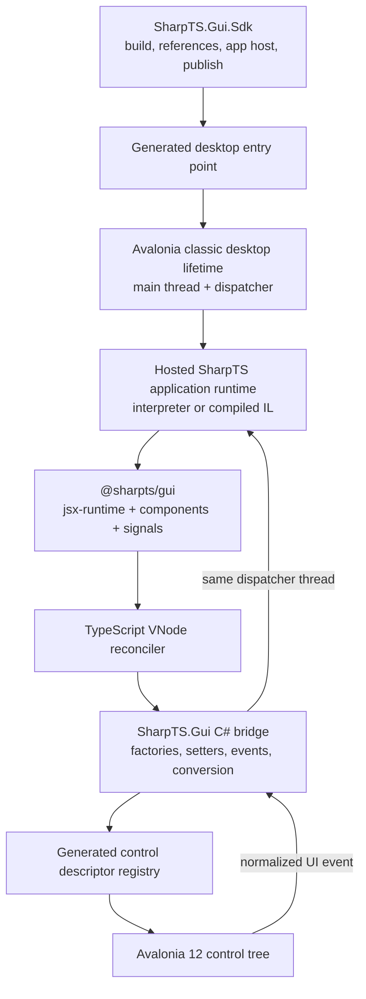

# Avalonia 12 + TSX for SharpTS

**Status:** Investigation and architectural recommendation
**Date:** 2026-08-07
**Initial scope:** Windows and macOS desktop applications
**Avalonia baseline:** 12.1.1, the latest stable release at the time of this investigation

## Executive summary

The integration is feasible, and SharpTS already has most of the language-facing foundation it needs. SharpTS parses `.tsx`, lowers JSX through the automatic runtime, honors `jsxImportSource`, type-checks function-component props, resolves npm-style modules, imports CLR types, and compiles TypeScript to .NET IL. Avalonia explicitly supports code-only applications with no AXAML, so TSX can construct the same control tree that AXAML would have produced.

The difficult part is not TSX syntax or basic CLR interop. It is ownership of the application thread and event loop. Avalonia requires control access on its UI dispatcher. Interpreted SharpTS has a blocking event loop and installs its own `SynchronizationContext`; compiled SharpTS emits equivalent blocking event-loop and synchronization-context machinery into the output assembly. Running either loop normally would starve Avalonia's dispatcher, while moving the interpreter to another thread would create synchronous callback, cancellation, and deadlock problems.

The recommended design is therefore:

1. Add a general **hosted event-loop/scheduler mode** to SharpTS.
2. Start Avalonia first on the process main thread, enter its dispatcher loop, and make that one dispatcher the owner of all application TypeScript.
3. Use `jsxImportSource: "@sharpts/gui"` with a SharpTS-specific automatic JSX runtime; do not depend on React and do not generate AXAML.
4. Have that TypeScript runtime create immutable virtual nodes and perform reconciliation/reactivity in TypeScript.
5. Put Avalonia control factories, property setters, child attachment, value conversion, and event normalization behind a small C# bridge generated from an explicit control manifest.
6. Keep raw `dotnet:` access as an expert escape hatch, not as the primary UI API.
7. Make `sharpts --compile <entry.tsx> -t exe` a first-class path for TypeScript-only desktop applications. Templates should select the Avalonia host explicitly; recognized desktop-mount operations may provide best-effort inference for simple project-free cases, with explicit overrides taking precedence.
8. Ship a dedicated SDK/template so applications that intentionally participate in the .NET project system can use ordinary `dotnet build` and `dotnet publish` commands.
9. Use the .NET SDK publish pipeline as the canonical desktop deployment implementation. The SharpTS CLI should generate/cache a deterministic internal SDK project and invoke the same implementation rather than recreate NuGet/MSBuild deployment semantics.

The first production release should use managed, self-contained publishing. Native AOT should be a later acceptance gate, after the control registry and hosted scheduler are proven reflection-free. The integration should be designed for both SharpTS execution modes, but it is reasonable to prove the interpreter path first and add compiled-mode parity before declaring the desktop API stable.

## Current upstream baseline

As of 2026-08-07, [Avalonia 12.1.1 is the latest stable GitHub release](https://github.com/AvaloniaUI/Avalonia/releases/tag/12.1.1), published on 2026-07-29. The corresponding [Avalonia 12.1.1 NuGet package](https://www.nuget.org/packages/Avalonia/12.1.1) and [Avalonia.Desktop 12.1.1 package](https://www.nuget.org/packages/Avalonia.Desktop/12.1.1) are available. The integration should pin a tested 12.1.x version centrally rather than use a floating package version.

Avalonia core is [MIT licensed](https://github.com/AvaloniaUI/Avalonia/blob/main/licence.md), so the proposed runtime and shims do not introduce a problematic core-framework license.

SharpTS and current Avalonia documentation both target .NET 10 for their primary examples. Avalonia 12.1.1 itself supports .NET 8 or newer, while this repository already targets `net10.0`, so there is no target-framework mismatch.

## What SharpTS already provides

### TSX is already a real compiler feature

SharpTS does not need a new TSX parser or a TSX-specific backend:

- [The JSX parser](../../Parsing/Parser.Jsx.cs) lowers JSX to classic or automatic-runtime factory calls.
- Automatic mode synthesizes imports from `<jsxImportSource>/jsx-runtime` or `<jsxImportSource>/jsx-dev-runtime`.
- The lowered calls are ordinary AST calls annotated with `JsxCallInfo`, so both the interpreter and IL backend consume the existing call representation.
- Fragments, children, spread attributes, `key`, TSX dialect parsing, and per-file JSX pragmas already exist.
- [The JSX type checker](../../TypeSystem/TypeChecker.Jsx.cs) checks intrinsic props and the first parameter of function components, then types the expression as `JSX.Element`.
- `tsconfig.json` already recognizes `jsx`, `jsxFactory`, `jsxFragmentFactory`, and `jsxImportSource`.

That means an Avalonia JSX runtime can be selected with:

```json
{
  "compilerOptions": {
    "jsx": "react-jsx",
    "jsxImportSource": "@sharpts/gui",
    "strict": true
  }
}
```

The dedicated Avalonia SDK should supply these two JSX defaults when the project does not override them. Debug builds should select `react-jsxdev` so VNodes carry file and line information for development diagnostics; release builds should normally use `react-jsx`.

### JSX checker gaps that matter for a GUI framework

The current checker is sufficient for an initial component API, but not yet for ideal UI diagnostics:

- Function-component props are checked, which supports exported components such as `Button(props: ButtonProps): JSX.Element`.
- `children` is deliberately exempt from normal attribute checking. The checker therefore cannot currently diagnose “a `Window` accepts one child” or type a panel's children precisely.
- `ref` is also exempt from normal attribute checking, so a nominally typed native-control ref is not yet checked at the JSX use site.
- Class-component prop inference, callable-object props, generic JSX inference, and exact JSX child arity are deferred in the current implementation. The generic gap affects typed structural components such as `For<T>` and `Show<T>`.
- Unknown component props can be diagnosed when built-in controls are exposed as actual functions rather than opaque callable objects.

For the first implementation, built-in controls should therefore be exported as typed function components and the renderer should issue runtime development diagnostics for invalid child models. The compiler follow-up should implement the standard TypeScript JSX hooks, especially `JSX.ElementChildrenAttribute`, and define typed `ref` handling rather than invent a framework-specific child contract. Generic structural components should either wait for generic JSX inference or use a deliberately non-generic v1 API. Async function components are outside desktop-v1 and should receive a clear runtime diagnostic; asynchronous loading should update signals after mount instead.

### CLR interop is strong, but is the wrong primary abstraction

SharpTS's [`dotnet:` interop](../dotnet-types.md) already supports construction, properties, fields, overloads, delegates, events, closed generics, indexers, extension methods, `Task`/`Promise` conversion, and both interpreted and compiled execution. A proof of concept can use it to create `Window`, `Button`, and layout controls directly.

It should not be the public UI model, for several reasons:

- Non-self CLR return types often surface as `any`, reducing the quality of a large raw Avalonia surface.
- Avalonia uses CLR properties, `AvaloniaProperty` identifiers, attached properties, routed events, collection content, and type converters. Reflection alone cannot turn those into an elegant, uniform TSX content model.
- The same TypeScript value may need different conversion rules depending on the property: a number, a `Thickness` shorthand, a grid track, a brush, or an enum.
- Raw event delegates inherit SharpTS's current threading constraint.
- Open-ended reflection and runtime control discovery work against trimming and Native AOT.
- Exposing every upstream member ties the TypeScript API directly to Avalonia's CLR naming and version churn.

Raw imports remain valuable for advanced controls and platform APIs, but the normal path should be a curated, generated TypeScript facade backed by explicit C# adapters.

### The existing event loops conflict with a GUI dispatcher

This is the principal engineering gap.

The interpreter's [event-loop implementation](../../Execution/Interpreter.cs):

- installs an `InterpreterSynchronizationContext` before top-level statements execute;
- queues continuations and callbacks into a `BlockingCollection<Action>`;
- runs a blocking drain/wait loop after the program's top-level statements;
- owns a virtual timer queue and Node-style active-handle count.

Compiled output has the same behavior in generated form. [The emitted event loop](../../Compilation/RuntimeEmitter.TSEventLoop.cs) uses a `ConcurrentQueue<Action>` and `ManualResetEventSlim`; generated entry points install `$EventLoopSyncContext` and call `$EventLoop.Run()`.

Avalonia also owns the UI thread's run loop and `SynchronizationContext`. If SharpTS blocks that thread in its current loop, input, layout, rendering, and window messages stop. If Avalonia blocks inside a call made by SharpTS, SharpTS timers and queued I/O callbacks are not pumped. Merely nesting the two loops is therefore insufficient.

### Delegate invocation is not currently safe across threads

[`DotNetDelegateShim`](../../Runtime/DotNet/DotNetDelegateShim.cs) explicitly requires a delegate to be invoked on the SharpTS event-loop thread. It immediately calls the guest function on whichever thread invoked the CLR delegate. The [.NET interop documentation](../dotnet-types.md#threading-contract) consequently marks off-thread delegate and event invocation as undefined behavior.

Most Avalonia control events are raised on the UI thread, which is favorable if the UI thread is also the SharpTS owner thread. Background services, timers, and third-party controls can still raise CLR events elsewhere. A GUI integration must never pass those straight into the interpreter.

### The build system provides a base, but desktop deployment is a larger change

[SharpTS.Sdk](../../SharpTS.Sdk/Sdk/Sdk.targets) already composes with `Microsoft.NET.Sdk`, resolves NuGet references, passes those assemblies to the SharpTS compiler, and participates in standard build/publish targets. That is the correct foundation, but the current CLI restore/deployment path reads managed runtime DLLs rather than the complete RID-specific native/content/build asset graph needed by Avalonia, and the existing SDK deliberately sets `UseAppHost=false`. Desktop work therefore includes real deployment integration, not only productization:

- add Avalonia package references and the SharpTS Avalonia runtime;
- select a hosted GUI entry-point target instead of the normal blocking console entry point;
- produce an app host (`UseAppHost=true`) for desktop packaging;
- carry Avalonia native runtime assets into publish output;
- supply the TSX module and declarations to the compiler and language server;
- add RID-aware packaging defaults and templates.

The current [SharpTS.Hosting](../../SharpTS.Hosting/README.md) package is focused on Native AOT CLI hosts with closed interop catalogs. It is useful prior art, but it is not an application-lifetime or dispatcher-aware embedding API.

## Relevant Avalonia 12 findings

### AXAML is optional

Avalonia's official [code-only UI documentation](https://docs.avaloniaui.net/docs/fundamentals/coded-ui) states that an application can contain no `.axaml` files and that controls, layouts, styles, bindings, and animations all have code APIs. AXAML and code produce the same runtime object graph. This validates TSX as a direct object-graph construction layer rather than an AXAML generator.

There is a tradeoff: the same documentation notes that most community material and the visual previewer assume XAML. SharpTS should compensate with strong TSX diagnostics, headless tests, a good component inspector, and eventually fast remount/hot reload. It should not maintain a hidden TSX-to-AXAML translation pipeline solely to recover the previewer.

### Avalonia uses a single UI thread

Avalonia's [threading model](https://docs.avaloniaui.net/docs/app-development/threading) requires all control creation and property access on the UI thread; invalid access throws. `Dispatcher.Post` is the fire-and-forget path and `InvokeAsync` is the awaitable path.

Avalonia 12 introduced [multiple dispatchers, one per thread](https://docs.avaloniaui.net/docs/avalonia12-breaking-changes#multiple-dispatchers-support), while still not supporting multiple UI threads. Library authors are advised to use an object's `Dispatcher` or `Dispatcher.CurrentDispatcher` instead of assuming `Dispatcher.UIThread`. A hosted SharpTS runtime should capture one owner dispatcher after Avalonia setup and require every mounted root in that runtime to use it. It must not imply that one interpreter can safely span several dispatchers.

Avalonia also installs a synchronization context so a .NET `Task` awaited from the UI thread normally resumes on the UI thread. Hosted SharpTS should cooperate with that context, not replace it.

### Desktop lifetime startup is the right host seam

Avalonia's [application lifetime documentation](https://docs.avaloniaui.net/docs/fundamentals/application-lifetimes) provides both `StartWithClassicDesktopLifetime` and manual `AppBuilder.Start`/`SetupWithLifetime` entry points. The code-only documentation demonstrates a `ClassicDesktopStyleApplicationLifetime` without an `Application` subclass or XAML.

The SharpTS host should use `ClassicDesktopStyleApplicationLifetime` for the first release, with `ShutdownMode.OnLastWindowClose` as the default. The host must initialize Avalonia before evaluating the application's top-level TSX module, because Avalonia types and synchronization-context-dependent operations are not safe before framework setup.

This lifetime boundary also preserves a future path to mobile. Avalonia desktop uses `IClassicDesktopStyleApplicationLifetime`; iOS/browser use a single-view lifetime, while Android uses an activity lifetime and view factory. Those adapters should remain outside the common renderer.

### Avalonia's content and event models need explicit adaptation

Avalonia controls do not have one universal child collection:

- A [`ContentControl`](https://docs.avaloniaui.net/controls/data-display/contentcontrol), including `Window` and `Button`, accepts one content value.
- A `Panel` owns a children collection.
- Decorators have a single child.
- Items controls consume items and templates rather than an arbitrary visual-child list.
- Grid placement, docking, and canvas coordinates use attached properties.

Likewise, Avalonia primarily uses [routed events](https://docs.avaloniaui.net/docs/events/), for which code may call `AddHandler`/`RemoveHandler` and choose routing strategies or whether handled events are observed. A generated bridge can model these rules explicitly; a generic CLR event wrapper cannot infer all of them ergonomically.

### Styles are not CSS

Avalonia [styles](https://docs.avaloniaui.net/docs/styling/styles) use selectors, style classes, property setters, resources, control themes, and the logical tree. A TSX `class`/`classes` prop maps naturally to Avalonia's class collection, but a React-style `style={{...}}` object should not be presented as though it were CSS.

Recommended initial API:

- direct control props for local values;
- `classes` for Avalonia style classes;
- `theme`/`requestedThemeVariant` helpers;
- a typed `style()` builder that creates real Avalonia selectors and setters;
- explicit resource helpers;
- no CSS parser in the first release.

### Testing and deployment have good upstream support

The [Avalonia headless platform](https://docs.avaloniaui.net/docs/testing/setting-up-the-headless-platform) provides the real control tree, layout, styling, binding, synthetic input, dispatcher flushing, and optional rendered-frame capture without a visible window. It is an excellent fit for TSX renderer tests.

Windows uses Avalonia's Win32 backend and does not require a Windows-specific .NET workload; see the [Windows platform guide](https://docs.avaloniaui.net/docs/platform-specific-guides/windows/). macOS uses Avalonia's own native backend and can be cross-compiled, but distribution still requires an `.app` bundle, metadata, signing, and notarization; see the [macOS deployment guide](https://docs.avaloniaui.net/docs/deployment/macos).

Avalonia supports [Native AOT](https://docs.avaloniaui.net/docs/deployment/native-aot), but warns about dynamic control creation, reflection, trimming, and third-party controls. Those are exactly the reasons to use an explicit generated control registry and to defer Native AOT certification until after the managed desktop path is stable.

## Recommended architecture



### Package boundaries

| Package or module | Responsibility |
|---|---|
| `SharpTS.Hosting.Abstractions` assembly/package | Small framework-neutral hosted-dispatcher, lifecycle, error, and compiled attachment ABI shared by SharpTS and UI adapters |
| `SharpTS.Gui` NuGet package | Avalonia host-dispatcher adapter, bridge, generated descriptors, themes, headless support hooks, and packaged TS module payload |
| `SharpTS.Gui.Sdk` MSBuild SDK | References, GUI compiler target, app-host generation, TSX defaults, assets, publish and RID integration |
| `@sharpts/gui` TypeScript module | `jsx`/`jsxs`/`Fragment`, typed components and props, VNodes, reconciliation, signals, styles, application helpers |
| SharpTS CLI integration | Application-host detection, hosted-output selection, RID-aware deployment options, and a project-free TypeScript application workflow |
| `SharpTS.Templates` additions | `sharpts new avalonia` TypeScript-only starter and `dotnet new sharpts-gui` SDK starter/test project |

The TypeScript module should be delivered by NuGet as an npm-compatible physical package, so users do not need a separate npm install. The SDK/package targets should materialize an ordinary `@sharpts/gui` package and its declarations under a deterministic `.sharpts`/intermediate module root used by the compiler and `sharpts-lsp`.

SharpTS's npm fallback provider is currently constructed directly by `ModuleResolver` and primarily describes the React family. General provider injection may still be valuable later, but it is a plugin/discovery feature in its own right and is not required for desktop-v1. Materializing a normal package uses the same resolver path in the CLI, SDK, tests, and language server and avoids hard-coding Avalonia resources into the SharpTS executable. The CLI's generated internal project should run the same package targets before compilation.

### Application startup

The normal console entry point must not execute the application module and then enter SharpTS's blocking event loop. Module evaluation also must not synchronously wait for a promise before Avalonia's dispatcher loop is running. A GUI-target entry point should instead:

1. Configure `AppBuilder` and `ClassicDesktopStyleApplicationLifetime` on the process main thread.
2. Install the selected theme and platform options.
3. Complete Avalonia setup, capture the one owner dispatcher, and create SharpTS in hosted mode without replacing Avalonia's synchronization context.
4. Post entry-module initialization to that dispatcher.
5. Call `lifetime.Start()` so Avalonia enters its blocking dispatcher loop before the posted initialization job runs.
6. Evaluate/invoke the TypeScript module as a hosted job on the dispatcher. A real top-level await must suspend and later resume the job; it must not run `WaitForPromise`, `$EventLoop.WaitForTask`, or a nested dispatcher/event loop.
7. Have `mountDesktop` set and show the main `Window` explicitly, because `ClassicDesktopStyleApplicationLifetime` may already have passed its initial `MainWindow` show step by then.
8. Treat successful module completion without a mounted root as a startup error for desktop-v1. Delayed/tray-only roots require an explicit lifetime policy rather than an implicit keep-alive accident.
9. Let Avalonia remain the only blocking run loop until shutdown.
10. On shutdown, stop accepting new guest work, cancel timers/I/O and other resources, run component/effect cleanup and unmount while the dispatcher is still valid, perform the defined final microtask checkpoint, detach callbacks, and dispose the runtime. Do not indiscriminately drain stale external callbacks after UI teardown.

Both interpreter and compiler need this topology:

- **Interpreter:** expose a reusable engine/module execution API whose event loop may be externally hosted. `SharpTSCli.Run` is too coarse because it owns parsing through process exit. Hosted module initialization needs a resumable top-level job API rather than the current synchronous `WaitForPromise` path.
- **Compiled IL:** add a GUI/hosted output target. Generated module initialization must be a callable/resumable body passed to the Avalonia host; the generated entry point must not install `$EventLoopSyncContext`, call `$EventLoop.Run()`, synchronously pump `$EventLoop.WaitForTask`, or call `Environment.Exit` directly in hosted mode.

Executable shape and application host should be separate compiler decisions:

```text
OutputTarget:    Dll | Exe
ApplicationHost: string host ID (built-ins: console, avalonia-desktop)
```

For source execution and `--compile -t exe`, select `avalonia-desktop` using the following precedence before evaluating the entry module:

1. an explicit CLI override such as `--app-type avalonia` or `--app-type console`;
2. an `application.type` setting in `sharpts.json`;
3. best-effort compiler recognition of a direct, semantically bound use of the desktop mounting API, normally `mountDesktop` from `@sharpts/gui`;
4. the existing console host as the default.

Templates must always write the explicit `application.type`; inference is only a convenience for simple project-free files. Aliases, re-exports, wrappers, dynamic imports, and conditional calls make general inference unreliable. Mere presence of an `@sharpts/gui` import is not sufficient because a console tool or headless test may share a component library. Automatic selection should report why the desktop host was selected and how to override it. Interpreted source execution and compiled EXE execution must use the same selection rules and hosted lifetime. The Avalonia integration should register its host ID/marker through an extensible compiler mechanism rather than hard-code every future UI framework into core output-target logic.

The hosted seam should be framework-neutral. Avalonia is the first adapter, but tests, WinUI, MAUI, game loops, or embedded hosts could reuse it.

### Hosted dispatcher and scheduler contract

The host-facing abstraction should transport turns onto the owner dispatcher; the SharpTS runtime should continue to own JavaScript macrotask, microtask, timer, and active-handle semantics. Keeping these layers separate prevents an Avalonia implementation detail from becoming the definition of JavaScript ordering. The exact API can evolve, but the transport needs these capabilities:

```csharp
public interface ISharpTSHostDispatcher
{
    bool CheckAccess();
    void Post(Action hostTurn);
    ISharpTSScheduledWork Schedule(TimeSpan delay, Action hostTurn);
}

public interface ISharpTSScheduledWork : IDisposable
{
    void Cancel();
}
```

The contract should represent scheduling, not Avalonia controls or guest callbacks. The SharpTS hosted scheduler coalesces runtime wake requests into host turns, executes the appropriate queued macrotask/timer, and performs the required microtask checkpoint before returning. An Avalonia implementation should use the captured runtime-owner dispatcher and a cancellable dispatcher timer/scheduled operation for the next SharpTS timer deadline. Public `ui.post`/`ui.invoke` helpers, if shipped, are separate conveniences and should not define this internal ABI.

Hosted-mode invariants:

- TypeScript application state has exactly one owner thread.
- Every mounted root in one runtime belongs to the same captured owner dispatcher; attaching a root from another dispatcher is an error.
- All top-level module code, components, signal effects, reconciler operations, and UI callbacks run on that thread.
- A transition from no runnable SharpTS work to runnable work requests a dispatcher turn; it does not start a second blocking loop or post one host work item per queued callback unnecessarily.
- A complete microtask checkpoint runs after each guest job (module-start/resume, UI event, timer, I/O/worker callback, and cleanup job) and before control returns to unrelated dispatcher work. This ordering is a semantic requirement, not a best-effort optimization.
- Posting while a drain is in progress, nested synchronous UI events, and reentrant `ui.invoke` calls have defined behavior and cannot start concurrent drains.
- Timer scheduling arms the dispatcher for the next deadline rather than polling every frame.
- Node-style active handles no longer own process lifetime; the Avalonia application lifetime does. They still participate in cleanup and explicit shutdown.
- The hosted adapter must not overwrite Avalonia's synchronization context.
- Unhandled guest errors/rejections flow through a host error sink with a defined log, startup-failure, and post-start policy.

### Compiled hosted ABI and versioning

Interpreter injection alone is insufficient: emitted `$EventLoop` code and generated module initialization also need a stable attachment point. `SharpTS.Hosting.Abstractions` should contain only the small host-dispatcher/lifecycle/error contracts required by both interpreted and compiled applications. Hosted output may depend on that assembly even when ordinary console output remains standalone.

The emitted program should expose a stable hosted initializer/shutdown surface (exact names may evolve) that accepts the host dispatcher, installs it into the emitted runtime, and invokes a resumable entry-module body. The Avalonia-generated `Main` should call the `SharpTS.Gui` desktop host and pass that initializer rather than embedding Avalonia logic throughout the compiler backend. `process.exit` and a numeric `main()` result must route through the hosted lifetime contract; they must not terminate the process behind Avalonia's back.

The TypeScript runtime, generated control descriptor table, C# bridge, hosted ABI, SharpTS compiler/runtime, and Avalonia baseline must have an explicit compatibility check. Numeric control/property/event IDs are scoped to a descriptor schema version or manifest hash; mount fails with a clear version-mismatch diagnostic rather than dispatching an ID against the wrong table.

### Process lifetime and shutdown semantics

Hosted mode must define how Node-compatible process behavior maps to an application lifetime:

- `beforeExit` does not fire whenever the JavaScript queues temporarily become empty while windows remain open. It participates only in the chosen application-shutdown sequence.
- `process.exit(code)` emits the synchronous guest exit event according to SharpTS semantics, then requests forced Avalonia lifetime shutdown with that code.
- Normal last-window shutdown may be cancelled by supported Avalonia closing/shutdown events before guest teardown begins.
- Once teardown commits, new guest work is rejected, resources are cancelled, cleanup scopes run on the owner dispatcher, one specified cleanup microtask checkpoint occurs, and late external completions are ignored safely.
- Shutdown and error behavior must be identical in interpreted and compiled modes.

### Off-thread callback policy

The C# bridge should normalize callback threading rather than expose it to application authors:

- Avalonia routed/control events already raised on the owner dispatcher invoke TypeScript synchronously. This preserves `handled`, cancellation, and closing-event semantics.
- A void notification arriving from a background thread is posted to the owner dispatcher before guest code runs.
- A background callback requiring an immediate return value is not silently marshalled. The bridge should reject unsupported shapes or provide a narrowly reviewed synchronous invocation path with deadlock detection.
- `ui.post(fn)` and `ui.invoke(fn)` may be exposed as escape hatches, but routine props and state changes should never require them.
- `ui.invoke` runs inline when already on the owner dispatcher.
- Long CPU work runs in a worker or host task and returns data. UI objects must never cross to that worker.

This is simpler and safer than putting the interpreter on a dedicated background thread and synchronously proxying every control access back to Avalonia.

## TSX runtime and renderer design

### Example developer experience

The following is illustrative rather than a frozen API:

```tsx
import {
    Button,
    StackPanel,
    TextBlock,
    Window,
    computed,
    mountDesktop,
    signal,
} from "@sharpts/gui";

const count = signal(0);

mountDesktop(
    <Window title="SharpTS Counter" width={420} height={260}>
        <StackPanel margin={24} spacing={12}>
            <TextBlock
                classes={["headline"]}
                text={computed(() => `Count: ${count.value}`)}
            />
            <Button onClick={() => count.value++}>
                Increment
            </Button>
        </StackPanel>
    </Window>,
);
```

Important characteristics:

- PascalCase Avalonia components are explicitly imported and receive typed props.
- The standard automatic JSX transform calls `@sharpts/gui/jsx-runtime`.
- JSX produces VNodes; it does not create controls during expression evaluation.
- Signals update only dependent properties/subtrees and batch work onto the UI dispatcher.
- `Window` and `Button` use their content model; `StackPanel` uses its children collection.
- No React package, hooks contract, DOM, HTML element names, or AXAML is involved.

### Why VNodes instead of immediate control construction

Creating an Avalonia control directly inside `jsx()` looks simple, but it creates long-term problems. A VNode layer provides:

- pure component composition before framework objects exist;
- delayed, enforceable UI-thread creation;
- keyed update and list semantics;
- property and event diffing without replacing the whole window;
- cleanup of event subscriptions and disposable resources;
- development validation of content models;
- headless renderer tests;
- a future path to mobile lifetime adapters without changing TSX syntax.

The VNode format should remain small: type/component, props, children, key, and optional development source information. It should not copy React's entire element or fiber model.

### Keep reconciliation in TypeScript

The TypeScript runtime already understands its own object, function, array, closure, and signal values. If VNodes were handed wholesale to C#, the bridge would need to understand different interpreter and compiled representations of guest objects and callbacks.

Instead, the TypeScript reconciler should call narrow bridge operations with stable CLR signatures:

```text
createControl(typeId) -> NativeControl
setProperty(control, propertyId, canonicalValue)
clearProperty(control, propertyId)
setContent(control, valueOrControl)
insertChild(panel, index, control)
moveChild(panel, from, to)
removeChild(panel, control)
addEvent(control, eventId, normalizedHandler) -> Subscription
releaseControl(control)
```

The TS runtime must normalize public shorthand values before crossing the bridge. Bridge inputs should be primitives, generated CLR DTOs/tokens, opaque native-control handles, and explicitly supported typed arrays/tuples—not arbitrary guest object graphs whose runtime representation differs between interpreted and compiled execution. Generated property adapters may still perform the final property-aware Avalonia conversion.

Event registration methods should accept a real generated delegate shape, allowing SharpTS's function-to-delegate conversion to adapt the handler in managed builds. The bridge then subscribes to the correct CLR or routed event and returns a disposable subscription. AOT certification later requires direct generated adapters for every supported delegate shape. `releaseControl` means detach renderer ownership and run descriptor-specific cleanup; most Avalonia controls are not generally `IDisposable`, so it must not blindly call `Dispose`.

### Generated control descriptors

Do not reflect over every loaded Avalonia type at runtime. Maintain a versioned manifest of supported controls and generate:

- numeric control/property/event identifiers scoped to the manifest schema/hash;
- a factory delegate;
- property and attached-property setter delegates;
- clear/reset behavior;
- value converter identifiers;
- child/content strategy;
- routed and CLR event adapters;
- TypeScript component functions, props, event types, and docs.

One metadata source must generate both sides so TypeScript declarations cannot drift from runtime behavior. Reflection can be used by the generator at package build time; application runtime should use the emitted delegates. Generation should validate inherited/hidden members, styled versus direct/read-only properties, reset semantics, child ownership, and event add/remove symmetry against the pinned Avalonia version.

For custom/third-party controls, later add an MSBuild registration item or source-generator extension that contributes descriptors and TypeScript declaration augmentation. Until then, raw `dotnet:` interop is the escape hatch.

### Prop conventions

Recommended conventions:

- CLR `Title`, `FontSize`, and `IsEnabled` become `title`, `fontSize`, and `isEnabled`.
- Events become `onClick`, `onPointerPressed`, `onTextChanged`, and so on.
- `classes` accepts a string, string array, or reactive value and maps to Avalonia classes.
- `name`, `automationId`, `dataContext`, `isVisible`, alignment, size, margin, and common accessibility props live on shared base interfaces.
- Attached layout props use ergonomic names such as `gridRow`, `gridColumn`, `gridRowSpan`, `dock`, `canvasLeft`, and `canvasTop`.
- An advanced `attached` escape hatch can accept typed property tokens.
- `ref` receives an opaque typed native-control wrapper after mount and `null` on unmount; compile-time checking depends on the JSX checker work described above.

Values should favor TypeScript-native shorthands while retaining explicit constructors/tokens:

```ts
type ThicknessValue =
    | number
    | readonly [horizontal: number, vertical: number]
    | readonly [left: number, top: number, right: number, bottom: number];

type BrushValue = string | Brush;
type GridTracks = string | readonly GridTrack[];
type Reactive<T> = T | ReadonlySignal<T>;
```

Converters must be property-aware and deterministic. Invalid conversions should report the component, prop, received value, and expected TypeScript form. Scalar and shorthand conversion conformance tests must run in both SharpTS modes to prove that the bridge ABI does not depend on a guest object representation.

### Child models

The descriptor for each component should choose one child strategy:

| Strategy | Examples | TSX behavior |
|---|---|---|
| No children | `Separator`, some images/progress controls | Development error for non-empty children |
| Single content | `Window`, `Button`, `Border`, `ScrollViewer` | Zero or one value/control; multiple children require a panel or fragment normalization rule |
| Panel children | `StackPanel`, `Grid`, `DockPanel`, `Canvas` | Ordered keyed controls |
| Items | `ListBox`, `ComboBox`, `ItemsControl` | Prefer `items` plus `itemTemplate`; declarative static items may be a convenience |
| Specialized | menus, tabs, tree controls | Dedicated typed child components or props |

Fragments flatten into the nearest multi-child context. A fragment under single-content control should become a generated lightweight panel only if the API explicitly documents that behavior; otherwise it should be an error, because hidden panels alter layout.

### Reactivity

Use a small signal system rather than imitating React hooks:

- `signal<T>(initial)` for mutable state;
- `computed<T>(fn)` for derived values;
- `effect(fn)` for explicit side effects and cleanup;
- reactive prop values for fine-grained property updates;
- keyed `For` and conditional `Show` components for structural changes once their v1 typing contract is chosen;
- dispatcher batching so multiple state writes cause one render pass.

Every mounted component/structural region needs an ownership scope for signal subscriptions, computed values, effects, event handlers, and cleanup. A component is invoked under a defined scope, and replacing/unmounting that scope disposes its dependencies in deterministic child-before-parent order. The v1 contract should state whether function components run only when structurally recreated or may re-run when reactive props change; it must not accidentally recreate component-local signals on ordinary scalar updates.

This model maps well to Avalonia's retained controls and avoids rebuilding an entire native subtree for a text change. It can coexist later with Avalonia bindings or MVVM, but it does not require guest TypeScript objects to implement `INotifyPropertyChanged`.

Avalonia 12 enables compiled XAML bindings by default, but a TSX renderer does not automatically receive XAML-compiler-generated binding accessors. That does not inherently put the primary SharpTS path on reflection: a reactive value should subscribe through the signal graph and call a generated, typed bridge setter for the target Avalonia property. Static values should be assigned directly. Structural signals should reconcile only the affected keyed region rather than remount the complete native subtree.

Avalonia also supports [creating compiled bindings from code](https://docs.avaloniaui.net/docs/data-binding/compiled-bindings#compiled-bindings-from-code). The bridge may expose that facility for strongly typed CLR view models, where a stable `TIn` and property expression exist. It is not a general binding mechanism for arbitrary guest TypeScript objects, especially when interpreter and compiled execution must behave identically. Reflection bindings may remain an explicit fallback for dynamic CLR interop, not the default reactive mechanism.

This architecture avoids the specific property-path reflection cost that compiled XAML bindings address, but it does not guarantee equal performance by itself. Interpreter dispatch, guest/CLR conversion, VNode allocation, reconciliation, and bridge calls still need measurement. Desktop-v1 performance gates should compare compiled XAML, code-only direct setters, compiled SharpTS TSX, and interpreted SharpTS TSX for initial mount, one-property updates, batched updates, keyed-list changes, allocations, and input-to-render latency. High-frequency animation should use Avalonia's animation system rather than a per-frame TypeScript reconciliation loop.

## Initial supported surface

Start with a deliberately useful subset instead of mechanically exporting every Avalonia class.

### Desktop application and windows

- Classic desktop lifetime and shutdown modes
- `Window`, dialog ownership, show/close, title, size, position, state
- Fluent theme and light/dark/system variants
- Application/window resources at a basic typed level
- Clipboard and storage-provider wrappers as async services after the core renderer is stable

### Layout and decoration

- `StackPanel`, `Grid`, `DockPanel`, `Canvas`
- `Border`, `ScrollViewer`, `Viewbox`
- grid row/column definitions and attached placement
- common alignment, spacing, margin, padding, min/max size

### Common controls

- `TextBlock`, `SelectableTextBlock`
- `Button`, `ToggleButton`, `CheckBox`, `RadioButton`
- `TextBox`, `MaskedTextBox` if its package surface is stable
- `Slider`, `ProgressBar`
- `ListBox`, `ComboBox`, a basic item template API
- `Image` and asset URI/loading helpers
- `TabControl`/`TabItem` after specialized-child behavior is defined

### Events and accessibility

- click, text/value/selection changes
- key, pointer, focus, loaded/unloaded, window closing/closed
- normalized event facade with `source`, `handled`, key/button/position data where applicable
- automation name/help/id and keyboard-navigation basics

Menus, complex data grids, trees, custom drawing, animations, control templates, native menus, drag/drop, and third-party controls should follow after the core contracts are stable.

## Tooling and project experience

There should be two first-class front doors backed by the same compiler, host, dependency-resolution, and deployment implementation.

### TypeScript-only applications

A project that contains only SharpTS code should not need a user-authored `.csproj` or require the user to invoke `dotnet` directly:

```powershell
sharpts new avalonia -n CounterApp
cd CounterApp
sharpts src/main.tsx
sharpts --compile src/main.tsx -t exe
sharpts --compile src/main.tsx -t exe --rid win-x64 --self-contained --single-file
sharpts --compile src/main.tsx -t exe --rid osx-arm64 --self-contained
```

The template's explicit `application.type` should select the Avalonia desktop host for ordinary source execution and `--compile -t exe`; direct `mountDesktop` recognition is a best-effort fallback for simple files. The compile command remains a framework-dependent build for the current platform unless deployment options request otherwise, but every Avalonia desktop executable still goes through the project-backed build/publish pipeline so package build targets and native assets are honored. `--single-file` requests bundling of the complete eligible deployment closure. `--rid` should have no `-r` short form because SharpTS already uses `-r` for .NET assembly references.

The TypeScript-only template should contain:

```text
CounterApp/
  sharpts.json
  tsconfig.json
  src/
    main.tsx
  assets/
  tests/
```

`sharpts.json` should describe the application type, entry point, identity, icon/assets, theme, and SharpTS/Avalonia package versions. For desktop-v1, the CLI generates and caches a deterministic internal SDK project under `.sharpts/` to reuse the .NET restore/build/publish machinery; that is an implementation detail rather than the user's project model. The generated project and effective properties should be inspectable in verbose diagnostics and safe to delete. An installed .NET SDK is therefore a documented desktop-v1 prerequisite. Eliminating it would be a separate SDK-less publishing feature involving runtime-pack acquisition and a much larger in-process deployment implementation.

### .NET-integrated applications

An application that intentionally commingles SharpTS with C# or a larger .NET solution should use the dedicated MSBuild SDK:

```powershell
dotnet new sharpts-gui -n CounterApp
cd CounterApp
dotnet run
dotnet publish -c Release -r win-x64 --self-contained
dotnet publish -c Release -r osx-arm64 --self-contained
```

The SDK template adds the project-system file to the same TypeScript layout:

```text
CounterApp/
  CounterApp.csproj
  tsconfig.json
  src/
    main.tsx
  assets/
  tests/
```

The dedicated SDK is the canonical implementation. The CLI's generated project supplies the same properties/items and invokes it so both front doors:

- pin compatible SharpTS and Avalonia versions;
- set the TSX automatic runtime defaults;
- add the C# bridge and TS module;
- choose hosted desktop entry-point emission;
- generate/copy a platform app host;
- add assets with the correct Avalonia build action;
- offer `SharpTSAvaloniaTheme`, application identity, icon, and packaging properties;
- resolve RID-specific managed and native assets;
- distinguish executable generation, single-file bundling, self-contained deployment, and Native AOT;
- produce equivalent application contents from the SharpTS CLI and MSBuild front doors;
- keep any internally generated CLI project deterministic, inspectable in verbose diagnostics, and safe to delete;
- make `sharpts --compile -t exe` work without a user-authored `.csproj`;
- make `dotnet run`, `build`, `publish`, and `clean` work normally;
- produce a useful diagnostic if ordinary `SharpTS.Sdk` is used with `mountDesktop`.

### Build and publish terminology

All TypeScript modules in the entry graph can be compiled into one application assembly, but the resulting deployment properties are independent:

| Term | Meaning |
|---|---|
| Executable | The output has a native launcher/app host rather than being only a managed DLL. |
| Single-file | Application assemblies and selected dependencies are bundled into one platform-specific file; native libraries may still require extraction. |
| Self-contained | The target does not need a separately installed .NET runtime because the selected runtime is deployed with the application. |
| Native AOT | Managed IL is ahead-of-time compiled to native code; this has separate reflection and trimming constraints. |

SharpTS's current `--compile -t exe` packaging is a framework-dependent single-file app host, not a runtime-self-contained deployment. It also does not model the entire package asset/build graph required by a desktop framework. Avalonia executables must therefore use RID-aware SDK publishing rather than extend the existing main-assembly bundler piecemeal or equate it with `--self-contained`.

In .NET terminology, publishing means compilation plus construction of a deployment-ready closure: the platform app host, managed dependencies, RID-specific native libraries, content/assets, runtime configuration, and optionally the .NET runtime and single-file bundle. It does not inherently create an installer, sign/notarize an application, or submit it to a store. SharpTS does not need a separate publish command for desktop-v1; the `--rid`, `--self-contained`, and `--single-file` compile options can request those semantics. A future `sharpts publish` command may be convenient shorthand for the same pipeline, but must not become a second implementation.

The LSP should understand the package declarations, surface control/prop/event documentation, and provide completion for attached props. Because there is no AXAML previewer, an interpreted development host can later watch files, recreate mounted roots, and preserve explicitly opted-in state.

## Publishing recommendations

### Windows

Initially certify:

- `win-x64`
- `win-arm64` if CI capacity is available
- framework-dependent debug builds
- self-contained release builds

Use the ordinary Avalonia Win32 backend and standard .NET publishing. Installer/MSIX/MSI production should be a separate packaging layer, not embedded in the renderer.

### macOS

Initially certify:

- `osx-arm64`
- `osx-x64`
- separate architecture-specific artifacts before attempting a universal binary

Publishing a directory is not sufficient for normal distribution. The SDK/template should generate or document the `.app` layout and `Info.plist`. The manual Apple `codesign`/`notarytool` workflow requires macOS, while [Avalonia Parcel documents cross-platform packaging, signing, and notarization](https://docs.avaloniaui.net/tools/parcel/packaging-for-macos). Optional Parcel integration may automate bundle, signing, notarization, and DMG steps, but the core build should still produce an inspectable unsigned bundle without depending on a commercial packaging service.

### Native AOT

Do not make Native AOT a desktop-v1 blocker. First ship managed self-contained applications. Then add an AOT gate requiring:

- generated factories/setters/events with no runtime control reflection;
- a closed custom-control registration set;
- no dynamic XAML loading;
- audited delegate shapes;
- trimming tests for every supported control and service;
- Windows x64 and macOS arm64 publish/run smoke tests.

SharpTS's existing Native AOT interop catalog work is relevant, but compiled TypeScript GUI applications and a Native AOT SharpTS compiler host are separate products and should not be conflated.

## Testing strategy

### Compiler and TSX tests

- Custom automatic-runtime import generation for `@sharpts/gui`
- Component prop, event, key, fragment, spread, and source-location behavior
- Standard `JSX.ElementChildrenAttribute`, child-arity, typed-ref, and selected generic-JSX diagnostics
- Module provider/package resolution in CLI, SDK, and LSP
- `mountDesktop` host detection for interpreted source and compiled EXE execution, explicit CLI/manifest precedence, console override, and false-positive cases
- identical hosted output from direct `--compile -t exe` and SDK-driven compilation
- Identical TypeScript-visible behavior in interpreter and compiled IL

### Hosted-runtime conformance tests

- Entry-module initialization runs only after the host dispatcher loop is active.
- True top-level await suspends/resumes without `WaitForPromise`, `$EventLoop.WaitForTask`, a nested dispatcher, or UI starvation.
- FIFO macrotask ordering and a complete microtask checkpoint after module jobs, UI events, timers, I/O, worker messages, and cleanup jobs.
- Timer order, cancellation, interval rearming, earlier-deadline replacement, and wake coalescing.
- Posting during a drain, nested synchronous UI events, reentrant owner-thread invocation, and off-thread notification delivery.
- Unhandled exception/rejection routing and identical startup versus post-start failure behavior.
- `process.exit`, normal last-window close, cancelled closing, `beforeExit`/`exit`, cleanup ordering, and ignored late callbacks.
- The same trace-based suite runs against a deterministic non-UI host, Avalonia Headless, interpreted SharpTS, and compiled SharpTS.

### Renderer tests

- Factory/property/value conversion table tests
- Content, panel, item, fragment, and attached-property behavior
- Keyed insert/move/remove with native control identity preservation
- Event replacement and exact unsubscription
- signal batching, computed dependency changes, ownership-scope cleanup, and error propagation; error-boundary behavior only if an error-boundary API is selected for v1
- unmount disposal and no retained guest callback references

### Headless Avalonia tests

- Create and show TSX windows in `Avalonia.Headless`
- Simulate pointer and keyboard input
- Flush dispatcher jobs and verify resulting signal/control state
- Render representative frames through Skia for visual regression tests on a pinned OS/backend/font set; use structural assertions elsewhere to avoid platform-pixel flakiness
- Run callbacks raised from background threads and prove that guest code executes only on the owner dispatcher

### Platform tests

- Windows and macOS launch/close smoke tests in both SharpTS modes
- window activation, menu/shortcut behavior, text input/IME, clipboard, file dialogs, and accessibility tree checks as those features land
- framework-dependent and self-contained artifact validation for `win-x64`, `osx-x64`, and `osx-arm64`
- compare SharpTS CLI and `dotnet publish` artifact contents, entry-point behavior, and assets
- prove a self-contained artifact runs on a clean test environment without a separately installed .NET runtime
- signed/notarized macOS artifact test in release CI when credentials are available

### Performance tests

- Compare compiled XAML binding, code-only direct setter, compiled SharpTS signal, and interpreted SharpTS signal property updates
- Measure cold startup, initial mount, batched updates, keyed insertion/move/removal, allocations, and input-to-render latency
- Assert a scalar reactive property change preserves native control identity and does not reconcile an unrelated subtree
- Exercise virtualized large lists and ensure the bridge does not defeat Avalonia virtualization

## Phased implementation plan

### Phase 0: feasibility spike

Goal: prove the lifecycle and thread model before building a broad API.

- Pin Avalonia 12.1.1 in a small repository project.
- Start a code-only classic desktop application and post module initialization before entering `lifetime.Start()`, proving that the posted job runs only after the dispatcher loop is active.
- Evaluate one interpreted `.tsx` module in hosted mode without installing the SharpTS synchronization context or entering the blocking event loop.
- Create `Window`, `StackPanel`, `TextBlock`, and `Button` through a minimal bridge.
- Deliver a click event to TypeScript on the UI thread.
- Use the existing interpreter `TickEventLoop()` and emitted `$EventLoop.PumpOnce()` only as temporary spike primitives.
- Integrate one SharpTS timer and one awaited .NET task after the dispatcher starts without starving Avalonia.
- Repeat with compiled IL using a temporary hosted entry-point prototype, including a thread-identity trace.
- Run a real-window smoke test on Windows and macOS before accepting feasibility; Headless alone does not prove platform main-thread/lifetime behavior.

Exit criterion: input, rendering, a timer, and an async continuation all remain responsive in both modes; no nested/blocking SharpTS loop runs; traces prove one owner thread; and the result is reproduced on Windows and macOS.

### Phase 1A: hosted interpreter runtime and semantic contract

- Introduce `SharpTS.Hosting.Abstractions` and the framework-neutral host-dispatcher/lifecycle/error contracts.
- Split interpreter module evaluation from blocking event-loop ownership and add resumable hosted top-level initialization.
- Make SharpTS retain ownership of macro/microtask, timer, and active-handle semantics while a host dispatcher transports turns.
- Add hosted timer/callback/microtask draining with exact ordering, reentrancy, cancellation, and wake-coalescing behavior.
- Define `process.exit`, `beforeExit`/`exit`, shutdown, cleanup checkpoint, error reporting, and late/off-thread callback rules.
- Add embedding APIs so the Avalonia host does not invoke the CLI as a library.

Exit criterion: a deterministic non-UI test host and Avalonia Headless can drive interpreted applications through the complete trace-based hosted-runtime conformance suite without replacing the host synchronization context or synchronously pumping a promise.

### Phase 1B: compiled hosted parity and ABI

- Emit the stable hosted initializer/shutdown attachment surface.
- Make compiled top-level initialization resumable and remove hosted paths through `$EventLoopSyncContext`, `$EventLoop.Run()`, and `$EventLoop.WaitForTask`.
- Route compiled numeric `main()` results and `process.exit` through the host lifetime rather than direct process termination.
- Add ABI version checks between emitted output, `SharpTS.Hosting.Abstractions`, and the GUI host.
- Run the same scheduler/lifetime/error traces against compiled output.

Exit criterion: the non-UI and Avalonia Headless hosts run the identical conformance suite in interpreted and compiled modes, including top-level await, worker/off-thread delivery, process exit, and shutdown cleanup.

### Phase 2A: minimal TSX renderer vertical slice

- Materialize a development `@sharpts/gui` package and JSX namespace through the normal module resolver.
- Implement small VNodes, function components, fragments, keyed reconciliation, refs, and deterministic ownership scopes.
- Implement signals, computed values, effects, batching, and scope cleanup.
- Hand-author the spike descriptors for `Window`, `StackPanel`, `TextBlock`, and `Button`; do not block this slice on the generator.
- Normalize all bridge values into the canonical cross-mode ABI and implement exact event unsubscription/release behavior.
- Add development diagnostics for child/content mismatches and reject unsupported async components.

Exit criterion: the counter and one async-loading example pass in interpreted/compiled and Headless modes; scalar updates preserve native identity, avoid unrelated subtree reconciliation, and release every subscription on unmount.

### Phase 2B: generated surface, typing, and useful core controls

- Define the versioned control manifest and generate the C# registry, TypeScript components/props/docs, converters, and descriptor schema/hash from it.
- Implement standard JSX child/ref diagnostics and the selected v1 typing strategy for `Show`/`For`.
- Add core layouts, form controls, common events, theme, attached props, basic items/templates, and accessibility props.
- Integrate package/declaration discovery and component documentation into the LSP.
- Add cross-mode conversion tables, child strategies, keyed list, cleanup/leak, and generated-surface validation tests.
- Establish initial mount/update/list benchmark baselines and verify that scalar signal updates use generated setters without reflection or full-tree remounting.

Exit criterion: the counter example plus a form, keyed list, and async-loading example pass in both modes and in headless tests; native control identity and non-reflective scalar update tests pass, and benchmark results are recorded against compiled XAML and code-only baselines.

### Phase 3A: dedicated SDK and development workflow

- Add application-host selection as a compiler concept orthogonal to DLL/EXE output.
- Add explicit CLI/`sharpts.json` host selection and best-effort direct `mountDesktop` inference with diagnostics and false-positive tests.
- Ship `SharpTS.Gui.Sdk` and the `dotnet new sharpts-gui` template.
- Materialize the TS runtime/declarations, select Debug/Release JSX modes, and add assets with the correct Avalonia build action.
- Make `dotnet run`, `build`, `publish`, and `clean` work normally for a framework-dependent desktop application.
- Add headless/visual test templates.
- Document raw Avalonia interop and custom-control limitations.

Exit criterion: a .NET-integrated user can create, run, test, build, and framework-dependently publish a desktop application using the dedicated SDK without writing C# or AXAML, with compiler/LSP package resolution and hosted entry behavior covered by integration tests.

### Phase 3B: TypeScript-only CLI and desktop release publishing

- Ship the TypeScript-only `sharpts new avalonia` template with explicit `application.type` and compatible pinned package versions.
- Generate/cache the deterministic internal SDK project and route CLI desktop build/publish through `SharpTS.Gui.Sdk`.
- Add `--rid`, `--self-contained`, and `--single-file` deployment options to `--compile -t exe`.
- Add complete managed/native/content asset publishing, platform app hosts, `.app` bundle metadata, and verbose generated-project diagnostics.
- Add Windows and macOS CI, packaging documentation, artifact-closure comparisons, and clean-machine launch tests.

Exit criterion: a TypeScript-only user can create, run, compile, and produce self-contained Windows and macOS artifacts using only `sharpts` commands and without authoring a `.csproj`; a .NET-integrated user can produce equivalent artifacts with `dotnet` commands. Neither path requires writing C# or AXAML, both use the same SDK implementation, and both are covered by clean-machine launch tests.

### Phase 4: ecosystem depth and AOT

- styles/resources/templates and richer items controls
- third-party/custom-control registration
- menus, dialogs, clipboard, drag/drop, custom drawing, and platform services
- interpreted remount/hot reload
- reflection/trimming audit and Native AOT certification
- mobile lifetime adapters after desktop contracts stabilize

## Risks and mitigations

| Risk | Level | Mitigation |
|---|---:|---|
| Competing Avalonia and SharpTS event loops | High | Build hosted scheduling first; make the UI dispatcher the sole owner; never nest the current blocking loops |
| Entry initialization/top-level await runs before or blocks the dispatcher | High | Post a resumable module job before `lifetime.Start`; execute it only after the dispatcher loop is active; conformance-test that no synchronous promise pump is reachable |
| Interpreter callback on a background thread | High | Bridge-level marshaling and owner-thread assertions; reject synchronous return-valued off-thread callbacks |
| Compiled-mode scheduler differs from interpreter | High | One conformance suite and a framework-neutral scheduling contract; hosted entry-point is a first-class compiler target |
| Compiled host ABI or descriptor/package versions drift | High | Small versioned abstractions assembly, generated compatibility metadata, manifest/schema hash, pinned compatible packages, and fail-fast mount checks |
| Runtime/typing descriptor drift | High | Generate TypeScript declarations and C# registry from one validated manifest |
| Guest value shapes differ between interpreter and compiled IL | High | TS-side canonicalization, narrow bridge DTO/primitives, and cross-mode conversion conformance tables |
| Reflection/trimming failures | Medium/High | Explicit generated descriptors; managed release first; closed AOT gate later |
| Invalid Avalonia child/content mapping | Medium | Per-control child strategy plus development and later compile-time diagnostics |
| Reactive scopes leak callbacks/controls or recreate local state | High | Explicit component ownership scopes, deterministic cleanup order, identity/leak tests, and a documented component re-execution contract |
| No XAML previewer or design-time data | Medium | Headless visual tests, component inspector, excellent LSP metadata, later interpreted remount |
| GUI host auto-detection is ambiguous | Medium | Templates always set the manifest; inference handles only semantically bound direct mount use; define CLI > manifest > inferred precedence and provide console/Avalonia overrides |
| CLI misses native/content/build assets | High | Make `SharpTS.Gui.Sdk` canonical and have the CLI invoke it through a generated project; never reconstruct a DLL-only package closure for GUI publishing |
| CLI and SDK deployment behavior drift | High | CLI-generated projects invoke the canonical SDK with equivalent properties/items; compare cross-front-door artifacts in tests |
| EXE, single-file, and self-contained are conflated | Medium | Separate options and documentation; validate self-contained output on a clean environment without .NET installed |
| Upstream Avalonia minor-version changes | Medium | Central exact version pin, compatibility tests, generated-surface review on upgrades |
| Third-party control explosion | Medium | Curated built-ins, registration extension point, raw interop escape hatch |
| macOS packaging/signing complexity | Medium | Separate packaging layer, generated bundle metadata, macOS release CI, optional Parcel support |

## Decisions fixed by this investigation

- One hosted SharpTS runtime owns exactly one dispatcher/thread, and all roots use it.
- Avalonia owns the sole blocking loop; entry initialization is posted and runs after that loop becomes active.
- Hosted top-level await is resumable and never uses the existing synchronous promise/event-loop pumps.
- The host transport and SharpTS's JavaScript scheduling semantics are separate layers.
- The TypeScript GUI package is materialized as a normal physical package for desktop-v1.
- Templates explicitly select `avalonia-desktop`; host inference is only a best-effort convenience.
- `SharpTS.Gui.Sdk` is a separate composing SDK with the clearest desktop defaults and dependency boundary.
- `SharpTS.Gui.Sdk`/the .NET SDK publish pipeline is canonical, and the TypeScript-only CLI uses a deterministic generated project.
- An installed .NET SDK is a desktop-v1 prerequisite; SDK-less deployment is separate future work.
- Standard TypeScript JSX contracts are extended for child/ref typing rather than introducing an Avalonia-only compiler contract.

## Remaining decisions to make early

The following choices materially affect implementation and should be recorded before Phase 1A ends; the emitted ABI choices must be fixed before Phase 1B begins:

1. The exact reusable/resumable SharpTS engine and hosted module-job API beneath the CLI.
2. The final host-dispatcher/lifecycle/error interfaces and the emitted hosted initializer ABI in `SharpTS.Hosting.Abstractions`.
3. The public reactivity API, component re-execution contract, ownership-scope cleanup order, and whether structural updates use built-in `Show`/`For` components in v1.
4. The control-manifest format, descriptor schema/hash algorithm, and stable extension mechanism for third-party controls.
5. The extensible application-host marker format and exact CLI/manifest override names.
6. The minimum desktop control set required before the API is called preview-ready.

## Final recommendation

Proceed, starting with the hosted event-loop feasibility spike rather than a large set of control declarations. Avalonia's code-only model and SharpTS's existing automatic TSX runtime make the surface syntax straightforward. The product succeeds or fails on whether SharpTS and Avalonia share one responsive owner thread with deterministic scheduling in both execution modes.

Once that seam is proven, a TypeScript VNode/signal runtime over a generated C# Avalonia bridge is the most maintainable design. It keeps the developer experience TypeScript-native, preserves Avalonia's real retained control tree, avoids AXAML generation and React dependencies, and centralizes cross-thread safety. Explicit template host selection plus limited inference lets `sharpts --compile -t exe` remain the natural workflow for TypeScript-only applications, while the dedicated SDK gives mixed .NET solutions the expected `dotnet` workflow. Both front doors should use the SDK-backed deployment implementation with compatibility checks and clean extension points for third-party controls, Native AOT, and later mobile lifetime adapters.
