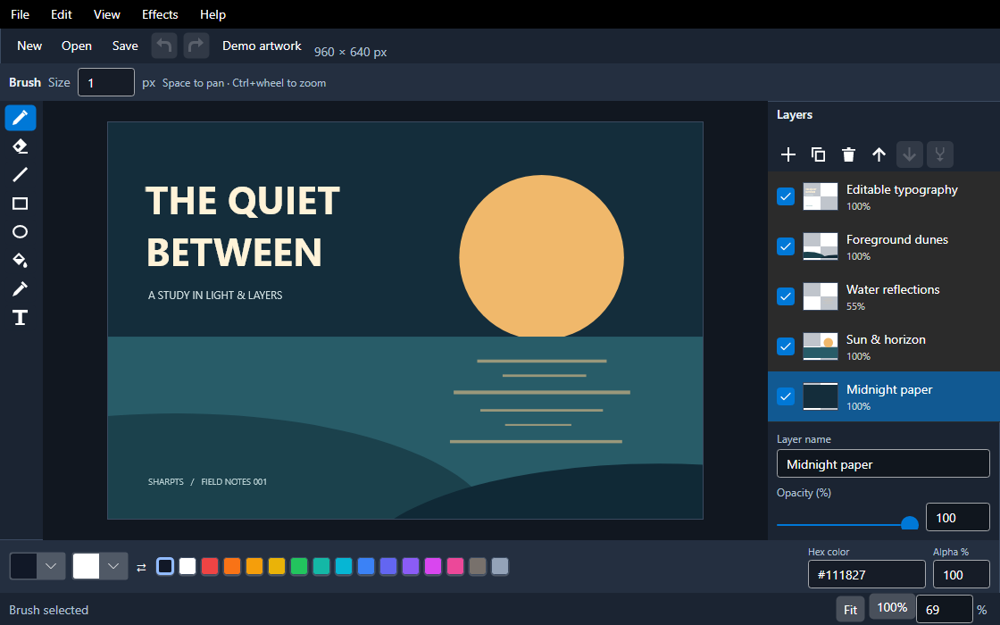

# SharpPaint

A native image editor written in TypeScript and TSX with `SharpTS.Gui.Sdk`. The same application runs interpreted or compiled.

Choose **Demo artwork** to explore an editable layered illustration, or start painting on the blank canvas. **F1** opens the shortcut reference. New documents include common screen, square, landscape, and portrait presets.



## Run and verify

From the repository, build and package the current SDK before launching:

```powershell
./samples/SharpPaint/run-local.ps1
./samples/SharpPaint/run-local.ps1 -Mode interpreted
./samples/SharpPaint/run-local.ps1 -Headless
```

With the SDK on a configured feed, use `dotnet run --project samples/SharpPaint -- --mode compiled` or `--mode interpreted`. Publish with `dotnet publish samples/SharpPaint/SharpPaint.csproj -c Release -r win-x64`.

The headless option above is a startup smoke test. Run the full workflow and measurement scenarios with:

```powershell
dotnet test tests/gui-conformance/SharpTS.Gui.Conformance.Tests -c Release --filter FullyQualifiedName~SharpPaintHeadlessTests
dotnet test tests/gui-conformance/SharpTS.Gui.Conformance.Tests -c Release --filter FullyQualifiedName~DrawingWorkloadsReportRasterCosts --logger "console;verbosity=detailed"
```

## Editing

- Brush, eraser, line, rectangle, ellipse, contiguous fill, composited picker, and retained text.
- Framed canvas, checkerboard transparency, brush footprint, Fit, 100%, and exact 1–800% zoom.
- Ctrl+wheel zooms around the pointer; Space-drag or middle-drag pans. Shift constrains lines to 45-degree increments and rectangles/ellipses to squares/circles.
- Layer thumbnails, visibility, ordering, duplication, merge down, exact opacity, and draft names.
- Rename commits on Enter or focus loss; Escape cancels. One opacity gesture produces one undo entry.
- Fifty named undo/redo steps, retained across saves. Undo always leaves a valid selected layer.
- Debounced effect previews beside the artwork, before/after comparison, exact values, and cancellation.
- Click retained text with Text to edit again. Ctrl+Enter applies; Escape cancels.
- RGB/ARGB hex colors, alpha, recent colors, and outlined swatches.
- Native New dialog, Save / Don't Save / Cancel, recent files, PNG import/export, and file drop.
- System light/dark theme, compact tool rail, scrollable inspectors, and a Layers toggle below 900 DIPs.

Tool shortcuts are `B E L R O F I T`; they leave text input alone. Document shortcuts are Ctrl+N/O/S, Ctrl+Shift+S, Ctrl+E (export), and Ctrl+Z/Y. Save finishes active field/text edits before capturing the document snapshot.

## Documents and recovery

`.sharpaint` v1 stores validated drawing commands and embedded PNG data, with a maximum dimension of 8192 pixels and 64 layers. Text remains editable until a raster operation affects its layer. Fill and effects rasterize the selected layer; merge combines it with its immediate neighbor. Undo restores original commands. This is not a Paint.NET file-format implementation.

Project saves use asynchronous UTF-8 I/O, a flushed sibling temporary file, and atomic replacement. A failed write preserves the destination and leaves the document dirty. The saved checkpoint is the snapshot actually written, so edits made during saving cannot silently become clean.

Two seconds after an edit, SharpPaint writes a recovery copy under the platform's local application-data directory in `SharpPaint`. Each window uses its own filename. Clean saves and approved normal closes remove that window's copy. After a crash, choose **File → Recover document**; recovery opens an unsaved document requiring Save As. Recent files use the same directory. `SHARPAINT_STORAGE_DIRECTORY` or the showcase's `storageDirectory` prop isolates storage for tests or portable installations. Recovery is best effort: edits within the debounce interval can be lost in a crash.

The document and file session live above the presentation error boundary. Retry preserves the document and history; the recovery screen also offers Save recovery copy.

## Build on this example

| Module | Responsibility |
| --- | --- |
| `SharpPaintApp.tsx` | Shell, commands, presentation boundary |
| `EditorCanvas.tsx` | Viewport, checkerboard, pointer navigation, text editor |
| `LayerPanel.tsx`, `ToolOptions.tsx`, `EffectPanel.tsx` | Contextual editing controls |
| `controls.tsx`, `NewDocumentDialog.tsx` | Paint icons, shared SDK field imports, document presets |
| `demo.ts`, `ShortcutHelp.tsx`, `RecoveryDialog.tsx` | Editable showcase artwork, help, named recovery copies |
| `editor-state.ts`, `document.ts` | Typed actions, history, paint semantics, portable format |
| `document-session.tsx` | Serialized file workflow, dirty checkpoints, recovery |
| `graphics-session.ts` | Cancellable jobs and stale-result protection |

Use the SDK's small command, dialog, task, scroll, and focus primitives. Keep the application's document format and editing policy explicit. The [desktop editing recipes](../../docs/gui/desktop-editing.md) explain this boundary.

The sample now consumes shared `TextField`, `NumberField`, `Inspector`, `IconButton`, semantic palettes, native color editors, and viewport navigation. Layers use native list selection, arrow-key navigation, and Alt+Up/Down ordering; dragging a thumbnail also reorders. Short windows collapse layer properties, and narrow windows show the inspector as a drawer. Effect Apply/Cancel remain pinned. Fit follows available canvas space; manual zoom preserves the view center. Switching tools or layers commits text; Escape/Cancel explicitly discards its draft.

Recovery copies are discoverable through a banner and a picker with document names and timestamps. Browse remains available for copies stored elsewhere. Selecting a recovery copy preserves the original and opens an unsaved document.

The workflow suite also runs `editor-state.tests.ts` and `presentation.tests.tsx`. Set `SHARPAINT_SNAPSHOTS` to capture the matrix; see [visual baseline instructions](visual-baselines/README.md) to compare reviewed images. The test driver's visibility checks include clipping, rather than checking only a control's local visibility flag.

## Performance and extensions

Empty input-only drawing surfaces allocate no bitmap. Logical drawing surfaces rasterize at displayed resolution, bounded by document resolution, so a 40×40 thumbnail does not retain an 8192×8192 bitmap. Layers preserve isolated erasing. Text uses native Avalonia shaping, fallback, and wrapping for display and export; appearance depends on installed fonts.

The repeatable workload reports raster timings, managed allocations, and BGRA buffer sizes for 10,000-point strokes at document, viewport, and thumbnail resolutions. These are raster costs, not end-to-end pointer latency or total native memory. Large exports/effects still need full-resolution buffers; edits still serialize command lists and invalidate changed layers. Tiled rendering, incremental strokes, and retained image handles need further profiling before promising very large documents.

See [drawing measurements](PERFORMANCE.md) for the measured baseline, methodology, and remaining profiling work.

General object transforms, advanced blending, plug-ins, multi-document tabs, variable-pressure brushes, and Paint.NET compatibility remain future extensions. The UI presents implemented features.
